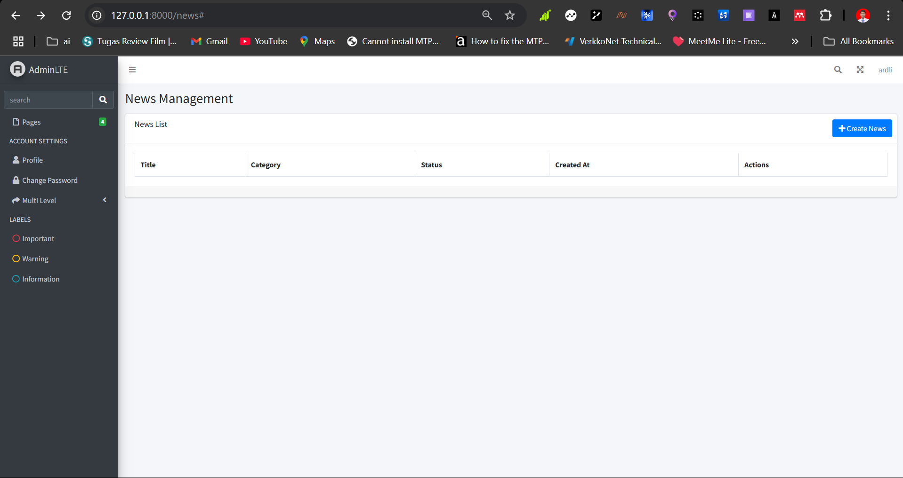

# Laravel & CodeIgniter Starter Kit UAS

Starter kit ini dibuat untuk memenuhi tugas UAS: membuat aplikasi starter kit berbasis Laravel 10.x+ dan CodeIgniter versi terbaru, terintegrasi dengan template AdminLTE, serta fitur autentikasi dan CRUD berita multi-level user.

## Fitur Utama
- **Framework:** Laravel 10.x+ (backend utama), CodeIgniter (opsional/bonus)
- **Template:** AdminLTE (Bootstrap)
- **Autentikasi:**
  - Login, Register, Reset Password, Lupa Password, Remember Me
  - Edit Profil User
  - Login via Github, Google, Microsoft (opsional)
- **Level Akses User:**
  - Admin
  - Editor
  - Wartawan
- **CRUD Berita:**
  - Unggah gambar
  - Kategori berita dari tabel kategori
  - Pengirim berita sesuai user login (wartawan)
  - Berita baru berstatus draft
  - Fitur approval berita oleh editor
- **Fitur Lain:**
  - CRUD kategori berita
  - Dashboard statistik berita & kategori

## Instalasi

1. **Clone repository**
   ```bash
   git clone <repo-url>
   cd laravel-starterkit-uas
   ```
2. **Install dependency Laravel**
   ```bash
   composer install
   npm install && npm run build
   ```
3. **Copy file environment**
   ```bash
   cp .env.example .env
   # Atur DB_DATABASE, DB_USERNAME, DB_PASSWORD sesuai database Anda
   ```
4. **Generate key & migrate database**
   ```bash
   php artisan key:generate
   php artisan migrate --seed
   ```
5. **Jalankan server**
   ```bash
   php artisan serve
   ```
6. **Akses aplikasi**
   - Buka [http://127.0.0.1:8000](http://127.0.0.1:8000)

## Akun Default (Seeder)
- **Admin:**
  - Email: `admin@example.com`
  - Password: `password`
- **Editor:**
  - Email: `editor@example.com`
  - Password: `password`
- **Wartawan:**
  - Email: `wartawan@example.com`
  - Password: `password`

## Tangkapan Layar

### Dashboard


### Halaman Login


### Form Berita


## Struktur Folder Penting
- `app/Http/Controllers` : Controller utama
- `app/Http/Middleware/CheckRole.php` : Middleware role user
- `resources/views` : Blade template
- `public/vendor/adminlte` : Asset AdminLTE
- `routes/web.php` : Routing utama

## Catatan
- Untuk login sosial (Google, Github, Microsoft), atur credential di `.env` dan `config/services.php`.
- Untuk fitur CodeIgniter, lihat folder `codeigniter-starter`.

## Create by Ardli Kafi Murobby
